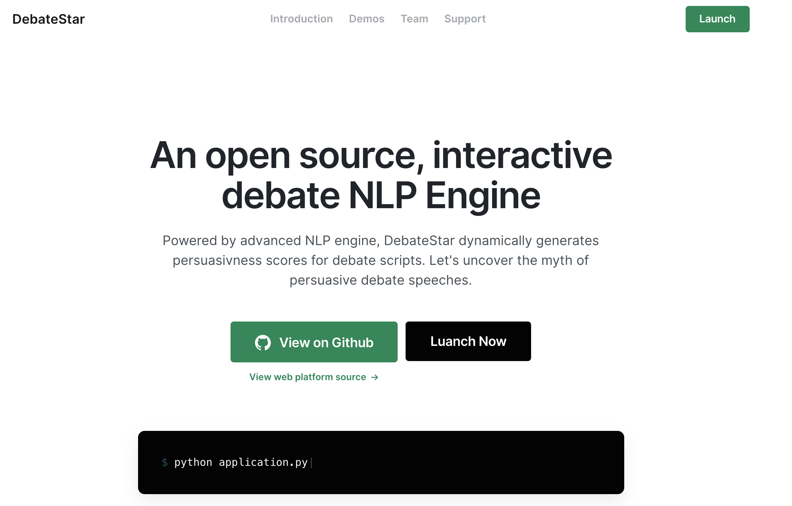

# DebateStar Web App

www.debatestar.net

## Introduction 

This implements an online data visualization platform for our NLP engine [DebateStar](https://github.com/maoli131/DebateStar). 
The main page highlights our project features, links to Github open source codes 
and introduces our team members. The visualization page serves as the main 
interface to interact with our NLP engine. It dynamically presents our model's prediction scores for varied debates.



## Technology

The backend is built with micro web framework Flask while the frontend is built with modern HTML5/CSS/Javascript and Bootstrap 4 (I used Flask's built-in Jinja 
template engine for easy deployment). The platform is deployed with AWS EC2, Nginx and Gunicorn. 

## Run on Local Machine

This web app requires Python 3 and all dependencies in virtual environment venv.

### Virtual Environment

Activate the virtual environment and install dependency packages.
```
python3 -m venv venv
source venv/bin/activate
pip install -r requirements.txt
```

### Run Flask

Run the backend Flask app with `application.py`
```
python application.py
```

## Run on AWS

Since Elastic Beanstalk has some issues with this project's static file directory,
we switched to use authentic EC2, Nginx and Gunicorn to deploy our platform.

A few notes on this. First, we created a Ubuntu 18 EC2 instance, download the private
key and modified `~/.ssh/config` to easily ssh into that machine. Then we downloaded
`pip` and `venv` to create virtual python environment and manage packages.

### Virtual Environment

As in local machine, we activate the virtual environment and install dependency packages.
```
git clone
python3 -m venv venv
source venv/bin/activate
pip install -r requirements.txt
```

### Ngnix

We chose `ngnix` as our reverse proxy. It listens on port 80 and routes traffic to
our web app. It can be configured to serve as load balancer.
```
$ sudo apt-get install nginx
$ sudo cp ~/debatestar-web/conf/nginx/debatestar.net /etc/nginx/sites-enabled/
$ sudo service nginx reload
$ sudo service nginx restart
$ sudo service nginx status
```

With this, we will be able to use default `python application.py` to launch our 
app in the cloud and visit it through AWS's public IP. 

### Gunicorn

We chose Gunicorn as our production server. It can be started as
```
gunicorn --bind 127.0.0.1:5000 application:app
ps ax|grep gunicorn    # see the process
pkill gunicorn         # kill the gunicorn process
```

Note that Gunicorn process is not easily managed, so we might use `supervisor`
to monitor them with configuration file in `conf` folder. Yet for simplicity,
we didn't use supervisor or other process management tool.

### HTTPS and more

We registered our domain name using Route 53, obtained static IP and then connect them
together so that the platform can be visted at www.debatestar.net

We use `Certbot` to enable HTTPS traffic. To do that, we configured the AWS's inbound
rule to allow 80, 440 and 22.

## Development Plan

In current stage, we've implemented the frontend pages and established a skeleton
for our backend modules. We will soon connect our model and display its output/result
interactively. 